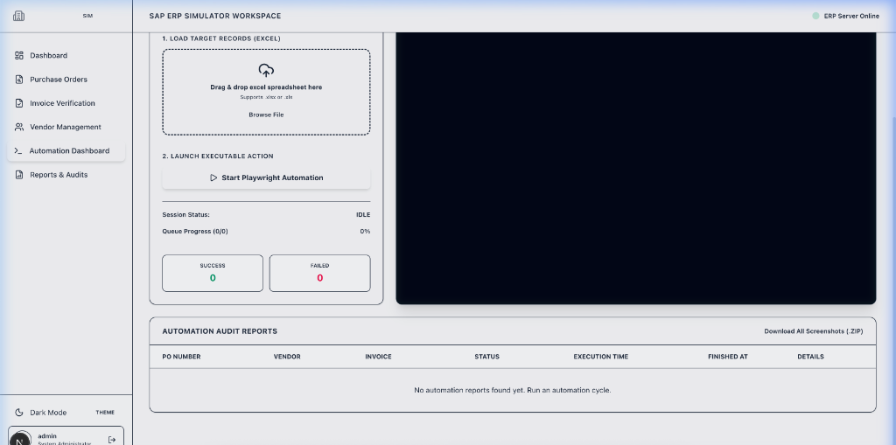
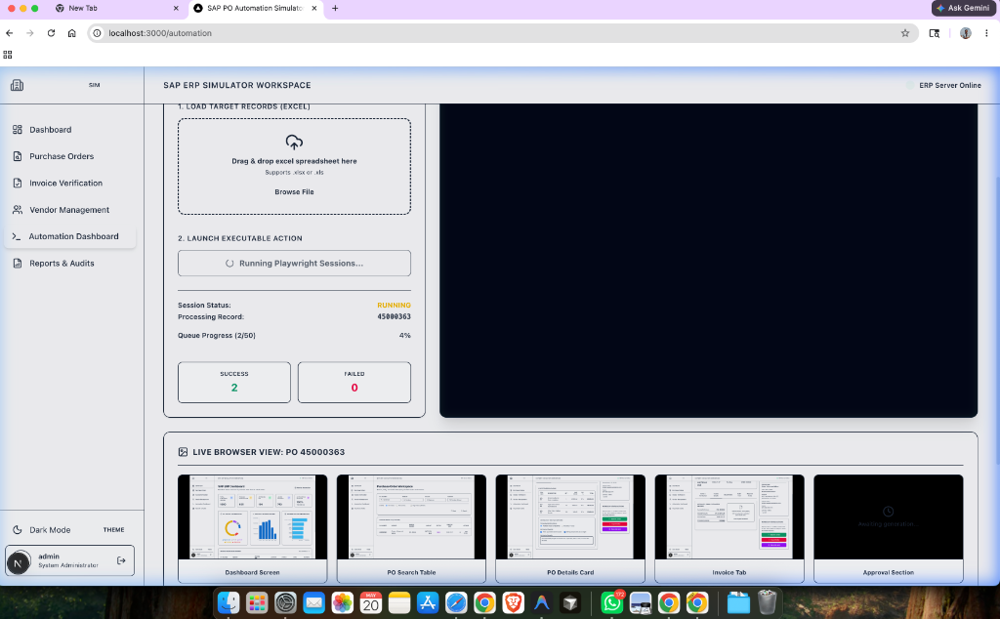
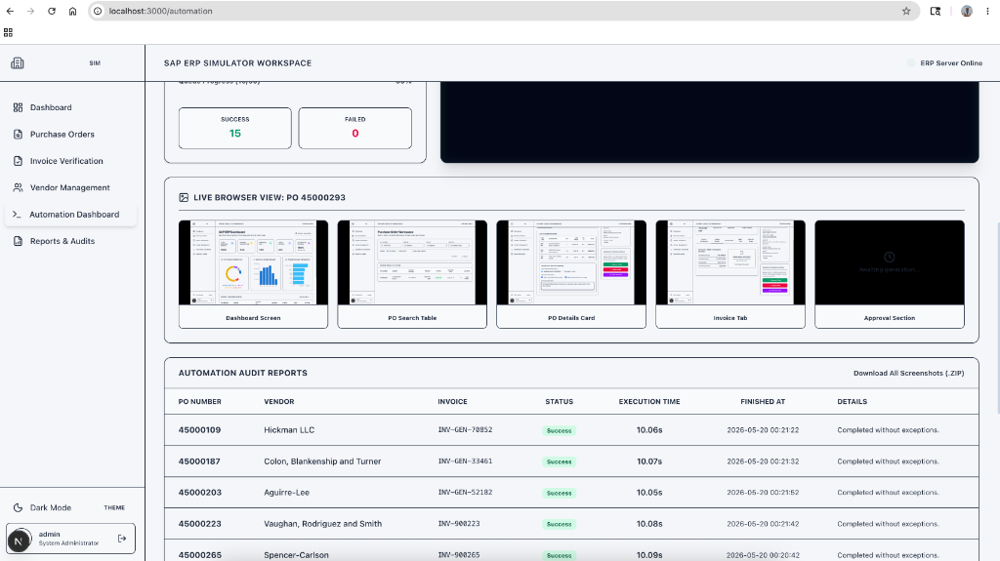

# SAP PO Automation Simulator & Playwright RPA Engine

An enterprise-grade, end-to-end local simulation and automation system. It mimics a real SAP Fiori Purchase Order (PO) invoice verification portal and automates the multi-step verification, matching, and approval workflow using **Python, Playwright, FastAPI, Next.js 15, and SQLite**.

---

## Technical Deep Dive: What is Happening?

The system models a real-world enterprise invoice matching workflow (Three-Way Match) where invoices are matched against purchase orders and goods receipts, audited for price/quantity mismatches, and approved or held inside the ERP system.

### 1. Database Schema (`apps/shared/database.db`)

* **`vendors`**: Stores vendor credentials, contract payment terms, address, email, phone, and GST tax registration numbers.
* **`purchase_orders`**: Contains purchase order headers (po_number, vendor_id, invoice_number, total amount, currency, status: `Draft | Pending | Approved | Rejected | Hold`, and created dates).
* **`invoices`**: Holds matching invoice metadata extracted from vendor submittals (invoice_number, PO number mapping, invoice amount, currency, status: `Pending | Verified | Approved | Rejected`).
* **`automation_runs`**: Logs every RPA subprocess transaction execution, duration speed, status (Success/Failed), timestamp, and error traces.

### 2. The Playwright Automation Pipeline

When you click **"Start Playwright Automation"** in the UI:

1. The **Automation Engine API (Port 8001)** receives the request and spawns the runner script (`automation_runner.py`) using the Python subprocess module.
2. Playwright launches a **Chromium browser window** on the host machine.
3. The robot signs in to the portal at `http://localhost:3000/login` using administrative credentials (`admin` / `admin123`).
4. For each purchase order listed in the uploaded Excel spreadsheet, the robot:
   * Opens the **Dashboard** and checks overall stats.
   * Navigates to the **Purchase Orders Workspace** and inputs the PO number into the search field.
   * Clicks the **Details** link to drill down into the invoice matching workspace.
   * Performs three-way verification by checking matching checklists and typing audit remarks.
   * Navigates to the **Linked Invoice** tab to audit the extracted VLM invoice scans.
   * Returns to the details tab and clicks **Approve**, **Reject**, or **Hold** depending on the instructions in the Excel sheet.
   * Saves screenshots at every major interaction checkpoint as audit logs.
5. All logs and screenshots are saved in `apps/automation-engine/outputs/{po_number}/` and can be downloaded as a single ZIP archive.

### 3. Critical Loop Progress Indicator

During automation execution, the Playwright RPA engine processes the list of purchase orders sequentially using a main event loop:

* **State Updates**: At the start of each iteration, the runner updates the global status file (`apps/automation-engine/outputs/status.json`) with the current PO number, index (`processed_count`), total record count (`total_count`), and success/failure counters.
* **Polling Mechanism**: The Next.js frontend polls the status API endpoint (`/api/automation-status`) every 1.2 seconds to fetch the updated progress.
* **Progress Bar**: The UI calculates the percentage completion `(processed_count / total_count) * 100` and displays a dynamic queue progress bar, live success/failure counts, and the specific PO code currently being processed.

### 4. Progressive Screenshot Builds

To ensure auditability, the robot saves screenshots at 5 critical checkpoints for each PO. The frontend implements a live, progressive screenshot viewer to monitor the robot's interactions step-by-step:

* **Checkpoints**: As the runner executes the verification flow for a PO, it writes:
  1. `dashboard.png` (Portal Dashboard entry)
  2. `search-results.png` (PO Search results grid)
  3. `po-details.png` (Verification checklists and remarks input)
  4. `invoice-tab.png` (Ollama VLM OCR extraction panel)
  5. `approval-section.png` (Final status submission and toast confirmation)
* **Progressive Display**: When a PO starts, the frontend displays animated "Awaiting generation..." placeholders.
* **Live Refresh**: As the files are saved to `apps/automation-engine/outputs/{po_number}/` by the backend, the corresponding image tags resolve in the UI. The frontend appends a cache-busting timestamp query parameter (`?t=timestamp`) to force the browser to bypass local caching and pull the newly built screenshots.

---

## RPA Automation Studio Dashboard

Below is the interface of the Next.js RPA Automation Studio frontend:

### Automation Studio Dashboard (Idle)

*Displays the control panel, Excel uploader, and empty audit report log before executing a run.*


### Automation Studio Dashboard (Running)

*Shows the queue progress indicator, active stdout terminal streams, and the live, progressive screenshots showing browser state changes in real-time. We just have to place the excel file, thats it !*


### Automation Audit Reports Table

*Displays the details of completed and verified PO runs with execution times, statuses, and exceptions, allowing admins to view results and download full artifact zip logs.*


---

## Automation Checkpoints (Visual Evidence)

Below are the actual screenshots captured by the Playwright engine at each checkpoint during the automated execution:

### Checkpoint 1: Portal Dashboard Page (`dashboard.png`)

*Captures the initial workspace entry and metric summaries before the run starts.*


### Checkpoint 2: PO Search Results Grid (`search-results.png`)

*Captured immediately after entering the target PO number and applying the search filter.*


### Checkpoint 3: Interactive Verification Workspace (`po-details.png`)

*Captures the material items table and the robot filling out the checkboxes and remarks.*


### Checkpoint 4: Linked Invoice Scan Details (`invoice-tab.png`)

*Captures the active invoice scanning card data extracted using Ollama VLM OCR.*


### Checkpoint 5: Approval Execution Confirmation (`approval-section.png`)

*Captured after the robot clicks "Approve Order", confirming the backend updated state successfully.*


---

## Local Installation & Running Guide

### Option A: Local Running (Host Machine)

Recommended to see the browser window launch and navigate through pages.

1. **Initialize Backend Virtual Environment**:

   ```bash
   python3 -m venv .venv
   source .venv/bin/activate
   pip install fastapi uvicorn pydantic faker pandas openpyxl playwright
   playwright install chromium
   ```
2. **Seed the Shared Database**:

   ```bash
   python3 apps/shared/seed.py
   ```
3. **Launch Backend & Automation APIs**:

   * **Terminal 1 (SAP Backend on Port 8000)**:
     ```bash
     source .venv/bin/activate
     python3 apps/sap-simulator/backend/main.py
     ```
   * **Terminal 2 (Automation API on Port 8001)**:
     ```bash
     source .venv/bin/activate
     python3 apps/automation-engine/api/main.py
     ```
4. **Launch Frontend Next.js Server**:

   * **Terminal 3 (Next.js on Port 3000)**:
     ```bash
     cd apps/sap-simulator/frontend
     npm install
     npm run dev
     ```

### Option B: Docker Compose Running (Headless Mode)

To run the entire system containerized:

```bash
docker-compose up --build
```

*Note: Playwright will run in headless mode inside the container.*

---

## Credentials & Testing

* **Login URL**: `http://localhost:3000`
* **Username**: `admin`
* **Password**: `admin123`
* **Demo File**: Click the link in the RPA Dashboard to download the `sample_po_list.xlsx`, then drag-and-drop it into the uploader to trigger the run!
